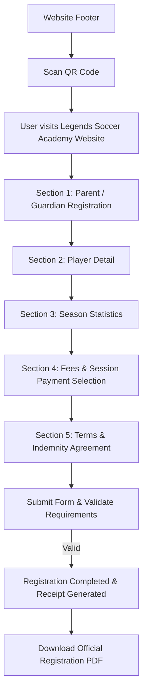

# Interactive Markdown Process Flow Spec — Legends Soccer Academy

## 1. System Overview & Registration Process Flow

## 2. Interactive Flow Steps & Features

### Step 01: Parent / Guardian Registration
- **Fields**: First Name, Surname, Email Address (or "No Email" toggle), ID / Passport Number (13-digit SA ID validation or Passport number), Cellphone Number, Doctor Name & Contact, Next of Kin.
- **Validation**: Strict client-side sanitization and SA ID checksum checking.

### Step 02: Player Detail
- **Fields**: Player Full Name, Date of Birth, Preferred Position, Skill Level.
- **Interactive Pitch**: Visual position selector on animated pitch backdrop.

### Step 03: Season Statistics
- **Fields**: Goals Scored, Assists Provided, Minutes Played.
- **Visuals**: Real-time player performance badge calculation.

### Step 04: Fees & Payment
- **Session Selection**: Single Day (R300), 2 Days (R500), 3 Days (R700), Full Camp (R900).
- **Proof of Payment**: File upload for bank payment receipt.

### Step 05: Terms & Conditions
- **Checks**: Academy Rules & Injury / Theft Indemnity Agreement.

### QR Code Integration (Footer)
- **Component**: Live SVG QR Code rendered using `qrcode.react`.
- **Target URL**: Direct link to official domain (`https://legendsacademy.co.za/`).
- **Purpose**: Enables coaches, guardians, and scouts to scan with mobile camera and quickly access or share the registration portal.

---
*Last Updated: July 2026*
